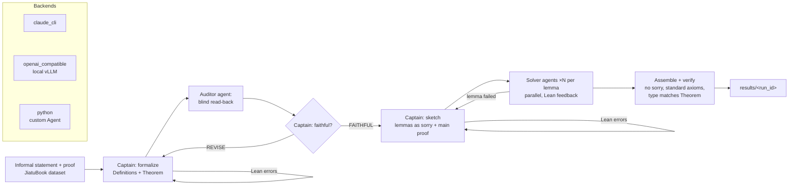
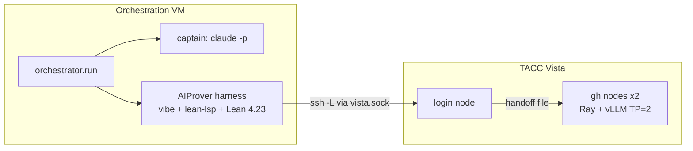

# Orchestration

A multi-model Lean 4 formalization and proving pipeline. An orchestrator
model (captain) formalizes an informal result, commissions a blind audit of
the formalization, decomposes the proof into lemmas, and assembles the final
solution. Worker models (solvers) prove the lemmas in parallel under Lean
error feedback. The roles and the Theorems/Definitions/Solutions layout follow
the [prove2me](https://github.com/prove2me/prove2me_workspace) playbooks
(`prove2me_workspace/references/mission_{captain,auditor,solver}.md`).
Verification is local; the prove2me server is not contacted.

Each role is served by a pluggable agent (`orchestrator/agents.py`), chosen
per role in the config file:

| Backend | Serves | Use |
|---|---|---|
| `claude_cli` | Claude models through the account session (`claude -p`, tools disabled) | captain |
| `openai_compatible` | Any OpenAI-schema chat endpoint: local vLLM, hosted open weights, proprietary gateways | auditor, solvers |
| `aiprover` | The AIProver harness (`AIProver/AIProver_plugin`, submodule): one agentic Lean session per sample, lean-lsp tools, model from `aiprover/aiprover*.toml` | solvers |
| `python` | A user subclass of `agents.Agent`, loaded by import path | custom agents |

The backends follow `../MixtureOfMathExperts/scripts/utils/generators.py`
(`claude_cli` and `vllm_endpoint` teachers). The default configuration runs
the captain on `claude-sonnet-5` and the auditor and solvers on
`Qwen/Qwen3-4B-Instruct-2507`, served locally by vLLM on one RTX 5070 Ti
(16 GB). `orchestrator/config_claude.json` runs all roles on Claude models;
`orchestrator/config_aiprover_vista.json` runs the captain on Claude and the
solvers on the AIProver model served on TACC Vista (see Deployment).



## Layout

| Path | Content |
|---|---|
| `orchestrator/agents.py` | Agent interface, backends, `AgentPool` (routing by role, retries, call records) |
| `orchestrator/aiprover_agent.py` | AIProver solver backend: job submission, sample collection, proof extraction |
| `orchestrator/claude_cli.py` | `claude -p` invocation, usage-limit parsing, account check |
| `orchestrator/lean_check.py` | `lake env lean` checks, forbidden-construct filter, axiom parsing |
| `orchestrator/prompts.py` | Captain, auditor and solver prompts |
| `orchestrator/pipeline.py` | Phases: formalize → audit → sketch → prove → assemble |
| `orchestrator/trace.py` | Step-by-step run record (`trace.json`), continued in place on resume |
| `orchestrator/resume.py` | Rebuilds a run's state from its trace for `--resume` |
| `orchestrator/structures.py` | Run data structures and parsing of model-written Lean |
| `orchestrator/trace_view.py` | Renders `trace.json` as a chapter walkthrough (`trace.html`, template `trace_view.html`) an orchestration graph (`trace_graph.html`) and an animated replay (`trace_replay.html`); shared code in `trace_common.{css,js}` |
| `orchestrator/run.py`, `config*.json` | Entry point; agent per role and budgets (`config.json` Sonnet + local chat solvers, `config_claude.json` all Claude, `config_aiprover.json` Haiku + local AIProver solvers, `config_aiprover_vista.json` Opus captain + AIProver model on Vista) |
| `aiprover/aiprover.toml`, `aiprover_vista.toml` | AIProver configuration: endpoint (local vLLM, or the Vista server through an SSH tunnel and handoff file); venvs, ripgrep and job directory under `aiprover/` |
| `AIProver/` | AIProver submodule (`PrithwishJana/AIProver`): plugin, CLI, pinned harness |
| `scripts/serve_aiprover_vista.sbatch`, `submit_aiprover_vista.sh` | AIProver model server on Vista GH200: Ray across nodes, vLLM tensor parallel, handoff file |
| `scripts/unpack_experts_vista.sbatch` | Fused-expert checkpoint to per-expert tensors for vLLM (CPU `gg` node) |
| `data/val_JiatuBook_unlabelled.jsonl` | JiatuBook validation problems (default `--dataset`) |
| `scripts/serve_local.sh` | vLLM OpenAI-compatible server for a local model (`.venv_serve`, vLLM 0.30.0) |
| `prove2me_workspace/` | Lean project (Lean v4.23.0, Mathlib `37df177`, clone of `prove2me/prove2me_workspace`); `.lake/packages` links the AIProver Lean project; final modules are written to `Definitions/`, `Theorems/`, `Solutions/` |
| `results/<run_id>/` | `trace.json` (every step, for replay), `trace.html` (walkthrough), `trace_graph.html` (graph), `trace_replay.html` (animated replay), `summary.json`, Lean modules, standalone file, JiatuBook-format output row |
| `logs/<run_id>/` | `calls.jsonl` (every prompt and reply), `run.log` |
| `temp/<run_id>/` | Live progress log and every Lean attempt file |

## Usage

```bash
claude auth status                         # captain: account session
scripts/serve_local.sh &                   # auditor/solvers: local vLLM on :8000
PYTHONPATH=. python3 -m orchestrator.agents          # probe every role
PYTHONPATH=. python3 -m orchestrator.run \
    --problem-uuid JiatuBook_BoundedArithmetic_000004 \
    --config orchestrator/config.json --workers 4
```

Runs are resumable. Every completed step (compiled formalization, audit
verdict, accepted sketch, proved lemma, replan) is recorded in
`results/<run_id>/trace.json`; `--resume --run-id <run_id>` replays these
records (`orchestrator/resume.py`) and continues from the last completed step
with the current configuration. A run that stops on an infrastructure failure
(a model call failing after all retries) resumes automatically up to
`--max-restarts` times (default 2).

A custom subagent replaces a role by pointing its entry at an
OpenAI-compatible endpoint (`base_url`, `model`, optional `api_key_env`) or at
a Python class:
`{"backend": "python", "class": "my_agent.module:MyAgent", "model": "..."}`,
where `MyAgent` subclasses `orchestrator.agents.Agent` and implements
`complete_once(prompt, system_prompt) -> Completion`.

A solution is accepted when the standalone file compiles without `sorry`,
`#print axioms solution` lists only `propext`, `Classical.choice` and
`Quot.sound`, and a check module importing both `Theorems.Thm_<slug>` and
`Solutions.Sol_<slug>` elaborates `example : type_of% @<slug> := @solution`.
A run is rendered as three linked, self-contained HTML pages: a step-by-step
walkthrough (problem, algorithm, prompts, audit, solver timeline,
verification) and a pannable graph of the captain, its subtasks, the agents
assigned to each, and their attempts; and a replay that animates the run
top to bottom on its recorded clock, from the input problem through the
parallel solver lanes to the verified proof, with a JPEG export of the
completed tree. Every step opens its full record
(prompt, reply, Lean source, compiler output). Generate both with
`python3 -m orchestrator.trace_view results/<run_id>/trace.json`.

The exported row can be scored with
`../PartitionAndProve/llm_inferAndEval/evaluate.py` for comparison with the
JiatuBook benchmark systems.

## Deployment: AIProver on Vista

The captain (Claude, through `claude -p`), the orchestrator, the AIProver
harness, Lean and the lean-lsp tools run on the orchestration VM
(`129.114.35.157`); only the model runs on Vista, whose compute nodes have
no internet egress (TACC.md §4). Vista has one GH200 per node, so tensor
parallelism spans nodes through a Ray cluster.



Environment (one-time, on the VM): Lean project
`~/workspace/lean_projects/TmpProjDir` (Lean v4.23.0, Mathlib `37df177`,
REPL, cslib), venvs and ripgrep under `aiprover/`, provisioned by
`AIPROVER_CONFIG=aiprover/aiprover.toml AIProver/AIProver_plugin/setup.sh deps`.

```bash
# Vista login node, repository root: start the model server
scripts/submit_aiprover_vista.sh /work/.../aiprover_ckpt            # gh, 2 nodes, 48 h
scripts/submit_aiprover_vista.sh /work/.../aiprover_ckpt gh-dev 2   # launch check, 2 h

# VM: ControlMaster (password + MFA once), then verify and run
ssh -fNM -S ~/.ssh/vista.sock -o ControlPersist=12h -o ServerAliveInterval=60 \
    loganluna@vista.tacc.utexas.edu
AIPROVER_CONFIG=aiprover/aiprover_vista.toml AIProver/AIProver_plugin/bin/aiprover doctor
PYTHONPATH=. python3 -m orchestrator.run \
    --problem-uuid JiatuBook_BoundedArithmetic_000004 \
    --config orchestrator/config_aiprover_vista.json --run-id vista_000004
```

The server job writes `node=<n> port=<p> job=<id>` to
`$SCRATCH/servers/aiprover_server.txt` before the weights load; the AIProver
CLI reads it through the ControlMaster on every tunnel (re)open, so a
resubmitted server is followed without configuration changes. After a
resubmission, `aiprover tunnel down` followed by `aiprover tunnel up`
replaces a forward that still targets the previous node. Fused-expert
checkpoints are first converted to per-expert tensors
(`scripts/unpack_experts_vista.sbatch`), the layout vLLM's loader reads. A bf16
checkpoint of ~222 GiB exceeds the HBM of two nodes (2 x 95 GiB); at two
nodes the job offloads the excess weights per rank to Grace memory
(`--cpu-offload-gb`, computed from the checkpoint size), or quantizes online
with `QUANTIZATION=fp8`. Three or more nodes serve bf16 entirely from HBM.

## Results

Problem `JiatuBook_BoundedArithmetic_000004` (`prop: bounding ite base`,
PV ⊢ ITR(ε, z∘ε) = ε), formalize-and-prove from the informal statement and
proof. Captain `claude-sonnet-5`; 4 solver chains per lemma, 4 repair rounds,
up to 2 replans.

| Run | Auditor / solvers | Status | Audit | Lemmas proved | Calls (captain / auditor / solver) | Wall time |
|---|---|---|---|---|---|---|
| `smoke_000004` | `claude-haiku-4-5` | proved, verified | FAITHFUL | 3 / 3 | 3 / 1 / 19 | 13.1 min |
| `local_000004` | `Qwen3-4B-Instruct-2507` (local vLLM) | lemmas unproved | FAITHFUL | 0 / 1 (3 sketches) | 9 / 1 / 60 | 16.1 min |
| `vista_smoke_000004` | AIProver base model (Vista, 2 x GH200), Sonnet 5.5 captain and auditor | proved, verified | FAITHFUL | 1 / 1 | 11 / 1 / 1 | 36.0 min |

In `smoke_000004` the formalization encodes PV at the object level (term
syntax, an inductive derivability relation with rules L0 to L4, the defining
axioms and structural induction); the solution uses only the `propext`
axiom. In `local_000004` the formalization and audit completed, and the
local solvers produced no compiling proof of the structural-induction lemma:
of 45 Lean checks, the dominant errors were unresolved constructor names
(for example `ax_ITR_eps` for `Deriv.ax_ITR_eps`) and failed `apply`
unifications. Per-step records are in `results/<run_id>/trace.json`, rendered
as `trace.html`, `trace_graph.html` and `trace_replay.html`.
