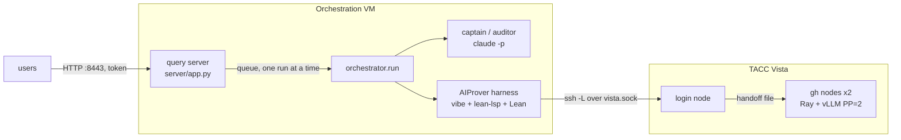

# Orchestration with AIProver on TACC Vista

How a formalize-and-prove run is executed with a Claude captain and the
AIProver model served on Vista. Cluster facts are in `TACC.md`
(PartitionAndProve); the orchestration pipeline is described in
`AIProver_README.md`.

## 1. Architecture

| Component | Runs on | Role |
|---|---|---|
| `orchestrator.run` | orchestration VM (`129.114.35.157`) | Phases formalize, audit, sketch, prove, assemble |
| Captain and auditor | VM, `claude -p` (account session) | Formalization, blind audit, decomposition, assembly |
| AIProver harness | VM (`AIProver/AIProver_plugin`) | One agentic Lean session per sample, lean-lsp tools |
| Lean v4.23.0, Mathlib `37df177`, REPL, cslib | VM, `~/workspace/lean_projects/TmpProjDir` | Harness project; its `.lake/packages` is linked by `prove2me_workspace/` |
| AIProver model | Vista `gh` nodes, vLLM 0.27.1 in `$WORK/containers/vllm-gh200.sif` | OpenAI-compatible API, pipeline parallel across nodes over Ray |

Vista compute nodes have no internet egress, so every Claude call and the
harness run on the VM. Only the model runs on Vista. The VM reaches it through
an SSH forward on a ControlMaster to the login node; the compute node and port
are read from a handoff file the server job writes.



## 2. Files

| Path | Purpose |
|---|---|
| `scripts/unpack_experts_vista.sbatch` | Fused-expert checkpoint to per-expert tensors (CPU `gg` node) |
| `scripts/serve_aiprover_vista.sbatch` | Model server: Ray across nodes, vLLM, handoff file, restart within the allocation |
| `scripts/submit_aiprover_vista.sh` | Submission wrapper: checkpoint, partition, nodes, wall time |
| `aiprover/aiprover_vista.toml` | AIProver configuration: ssh endpoint, handoff path, runtime budgets, local paths |
| `orchestrator/config_aiprover_vista.json` | Captain Opus 5.5, auditor Haiku 4.5, AIProver solvers (4 samples, 100 turns, 5400 s) |
| `orchestrator/config_aiprover_vista_smoke.json` | Captain and auditor Sonnet 5.5, AIProver solvers (2 samples, 60 turns, 1800 s) |
| `data/val_JiatuBook_unlabelled.jsonl` | Problem set (default `--dataset`) |
| `orchestrator/config_aiprover_vista_served.json` | Smoke configuration with at most 10 Claude calls per run (query server) |
| `server/`, `scripts/aiprover_query_server.service` | Query server and its systemd user unit (§5) |

On Vista the scripts are under `$WORK/aiprover_serve/scripts`
(`$WORK = /work/11757/loganluna/vista`). Job logs are written to
`$SCRATCH/joblogs` (`$SCRATCH = /scratch/11757/loganluna`); the handoff file
is `$SCRATCH/servers/aiprover_server.txt`.

## 3. Model checkpoint

The served model is the trained AIProver model,
`/work/11428/pjana/aiprover_model`: Mistral native format (`params.json`,
`tekken.json`, `consolidated-0000{1..7}-of-00007.safetensors`), FP8 e4m3
weights with per-tensor scales, 112 GB; 36 layers, MLA attention, 128 routed
experts (top-4) and one shared expert per layer, stored per expert. It is
served without conversion: the job detects `params.json` and uses vLLM's
Mistral config and loader, as `AIProver/AIProver_plugin/serve/` does.

| Checkpoint | Format | Path |
|---|---|---|
| AIProver, trained (default) | Mistral, FP8 | `/work/11428/pjana/aiprover_model` |
| Base (untrained), per-expert | HF, bf16 | `$SCRATCH/aiprover_ckpt/leanstral_base_unpacked` |
| Tiny (random weights, launch checks only), per-expert | HF | `$SCRATCH/aiprover_ckpt/leanstral_tiny_unpacked` |

HF-format checkpoints in the transformers fused layout are converted once to
the per-expert tensors vLLM's DeepSeek loader reads
((`experts.<e>.{gate,up,down}_proj.weight`, from `experts.gate_up_proj` and
`experts.down_proj`):

```bash
# Vista login node
cd $WORK/aiprover_serve
sbatch -t 01:00:00 --export=ALL,SRC=<fused ckpt>,DST=$SCRATCH/aiprover_ckpt/<name>_unpacked \
    scripts/unpack_experts_vista.sbatch
```

The job ends with `UNPACK OK` after checking the expert-tensor count.
`config.json` and the tokenizer files are copied unchanged; routing is
`topk_method: noaux_tc`, `scoring_func: softmax`, one group, top-4,
normalized, as in transformers' `Mistral4TopkRouter`. The 222.4 GiB base
checkpoint converts in about 6 minutes.

`$SCRATCH` is purged after 10 days without access; a checkpoint kept for
longer belongs on `$WORK`.

## 4. Running

### 4.1 ControlMaster (VM, once per 12 h)

TACC requires MFA, so the master connection is opened by hand. Every later
`ssh`, `scp` and tunnel uses it without a prompt.

```bash
ssh -fNM -S ~/.ssh/vista.sock -o ControlPersist=12h -o ServerAliveInterval=60 \
    loganluna@vista.tacc.utexas.edu
ssh -S ~/.ssh/vista.sock -O check vista.tacc.utexas.edu      # "Master running"
```

### 4.2 Model server (Vista login node)

```bash
cd $WORK/aiprover_serve
scripts/submit_aiprover_vista.sh /work/11428/pjana/aiprover_model gh-dev 2 02:00:00
scripts/submit_aiprover_vista.sh /work/11428/pjana/aiprover_model gh 2 12:00:00
```

`gh-dev` starts within minutes and is limited to 2 h; `gh` allows 48 h with a
queue of about one day. The server is ready when its log reports
`Application startup complete`:

```bash
cat $SCRATCH/servers/aiprover_server.txt
grep -E "startup complete|KV cache size|Error" $SCRATCH/joblogs/vllm_aiprover_<job>_a1.log
```

Server arguments set by the job for a Mistral-format checkpoint:
`--tokenizer-mode mistral --config-format mistral --load-format mistral`,
`--tensor-parallel-size 1 --pipeline-parallel-size <nodes>`, Mistral tool-call
and reasoning parsers, `--max-model-len 1048576`; the FP8 weights fit in HBM on
two nodes, so nothing is offloaded. For an HF checkpoint the job uses
`--config-format hf --load-format safetensors`,
`--limit-mm-per-prompt '{"image": 0}'`, tensor parallelism and
`--max-model-len 262144`. Settings are overridden through the environment at
submission (`PARALLEL`, `MAX_MODEL_LEN`, `PORT`, `QUANTIZATION`,
`CPU_OFFLOAD_GB`, `MAX_ATTEMPTS`, ...; see the script header).

### 4.3 Endpoint check (VM)

```bash
cd ~/workspace/aiprover_prove2me_workspace
export AIPROVER_CONFIG=$PWD/aiprover/aiprover_vista.toml
AIProver/AIProver_plugin/bin/aiprover tunnel down     # drop a forward to a previous node
AIProver/AIProver_plugin/bin/aiprover tunnel up
AIProver/AIProver_plugin/bin/aiprover doctor          # 15/15 PASS expected
```

`doctor --full` adds the harness self-test, all 23 lean-lsp tools and one
live AIProver rollout.

### 4.4 Orchestration run (VM)

```bash
cd ~/workspace/aiprover_prove2me_workspace
PYTHONPATH=. python3 -m orchestrator.run \
    --problem-uuid JiatuBook_BoundedArithmetic_000004 \
    --config orchestrator/config_aiprover_vista_smoke.json \
    --run-id <run_id> > temp/<run_id>.out 2>&1 &
tail -f temp/<run_id>.out
```

Progress: `temp/<run_id>/progress.log`; AIProver jobs:
`aiprover/work/jobs/`; model calls: `logs/<run_id>/calls.jsonl`. A run
continues from its last completed step with
`--resume --run-id <run_id>`, also against a resubmitted server.

### 4.5 Outputs and shutdown

```bash
PYTHONPATH=. python3 -m orchestrator.trace_view results/<run_id>/trace.json
```

`results/<run_id>/` holds `summary.json`, the Lean modules, the standalone
solution, `trace.json` and the pages `trace.html` and
`trace_replay.html`. The server is released with `scancel <job>` on Vista and
the forward with `aiprover tunnel down` on the VM.

## 5. Query server

`server/app.py` (FastAPI, uvicorn) accepts problems over HTTP on the VM and
runs them through `orchestrator.run` with
`orchestrator/config_aiprover_vista_served.json`:

| Setting | Value | Reason |
|---|---|---|
| Captain | Opus 5.5, effort high, 128,000-token replies | |
| Auditor | Sonnet 5.5 | |
| `max_claude_calls` | 10 (captain and auditor) | At the bound a run stops with `error_kind = budget` |
| `aiprover_attempts_per_lemma` | 1 (5 for G-Simple Theorem 3.3, set per run) | Completed jobs per lemma statement; jobs stopped by a lost server do not count |
| `aiprover_session_slots` | 8 | Sessions shared by a run's jobs, weighted towards lemmas with more failed attempts |
| `aiprover_handback_after` | 3 | Failed jobs after which the captain proves, splits, restates or retries the lemma (once per statement); acts only when `aiprover_attempts_per_lemma` exceeds it |
| Solver | AIProver, 2 samples, 200 turns, 5400 s | Two independent sessions per lemma; at 60 turns 11 of 30 samples stopped after 20-55 min, well inside the clock |
| `aiprover_lemma_concurrency` | 4 | 8 sessions (2 samples per lemma), the harness's `max_parallel`; the trained model decodes 28 tokens/s per request at 8 concurrent requests |
| `max_replans` | 1 | The replan prompt lists, per failed lemma, the samples' last code (helpers and lemma, comments kept) and the Lean errors in it, most informative first |
 A problem is a JiatuBook UUID or a free-text informal
statement with an optional informal proof; the latter is written as a one-row
dataset under `server/state/problems/`.

A submission is held as `awaiting_approval` until a token holder approves or
rejects it on the page (`POST /api/runs/<id>/approve`, `/reject`). Approved
runs start in submission order, up to two at once (`QUERY_SERVER_MAX_RUNS` in
the unit). Concurrent runs share the Vista server and AIProver's
`max_parallel = 16` sessions on the VM (4 lemma jobs × 2 samples per run); two
runs of the same problem do not overlap, since a run's modules in
`prove2me_workspace/` are named after its theorem, and the final `lake build`
of each run holds a lock on the workspace.

The worker manages the model server (`server/vista.py`, through the
ControlMaster):

| Condition | Action |
|---|---|
| Approved run waiting, endpoint down, no `aiprover_srv` job in `squeue` | Submit `scripts/submit_aiprover_vista.sh` (`gh`, 2 nodes, 12 h, set in the unit) |
| Server job pending or loading | Wait; endpoint probed every 60 s |
| Endpoint up | Open the tunnel and start the run |
| Model server lost during a run | The run stops as an infrastructure failure, is requeued at the head and resumes (`--resume`) on the next server job, without limit; it ends after 3 resumptions in a row that add no formalization, verdict, sketch, proved lemma or replan |
| No queued or running run for 15 min | `scancel` the server jobs the worker submitted (listed in `server/state/jobs.db`) |

Partition, nodes, wall time and checkpoint are set by `VISTA_PARTITION`,
`VISTA_NODES`, `VISTA_WALL_TIME` and `VISTA_CHECKPOINT` in the unit's
environment. Server jobs submitted by hand are not cancelled. The
ControlMaster still has to be reopened with MFA every 12 h; while it is
closed, approved runs wait and the page reports it.

The AIProver model's reasoning is recorded by `server/reasoning_proxy.py`
(user unit `scripts/aiprover_reasoning_proxy.service`, 127.0.0.1:18565): served
runs reach the model through `aiprover/aiprover_vista_logged.toml`, which
directs the harness to the proxy; the proxy forwards to the tunnel
and appends each completion's `reasoning` to the session's
`reasoning.jsonl`, since the harness's agent discards that field. The agent
sends no `max_tokens`; the proxy sets 24,576 tokens per reply
(`--max-reply-tokens`), above all but a handful of recorded replies and
about 14 min at 8 concurrent sessions, so a reply that does not converge
cannot hold a session until its 90-min clock. Past tool calls whose
arguments are not JSON, or whose names vLLM does not accept, are replaced
(`{}`, sanitized name) before forwarding; vLLM would reject the request and
the harness restart the session. A run is not started while
the proxy is down.

Job records are kept in `server/state/jobs.db`. Runs start in their own
session: after a server restart a live run is adopted, a run that finished
meanwhile is recorded, and an interrupted run is requeued and resumed.

```bash
# VM, once: tokens (one per user) and the service
python3 -c "import secrets; print(secrets.token_urlsafe(32))"   # add to server/tokens.json
mkdir -p ~/.config/systemd/user
cp scripts/aiprover_query_server.service ~/.config/systemd/user/
systemctl --user daemon-reload
systemctl --user enable --now aiprover_query_server
sudo loginctl enable-linger loganluna                            # survive logout
journalctl --user -u aiprover_query_server -f
```

`server/tokens.json` maps a token to a user name (`server/tokens.example.json`)
and is re-read on change. TCP 8443 must be open in the VM's security group.
`Environment=QUERY_SERVER_AUTH=off` in the unit disables tokens: every
visitor sees and may cancel every run. Removing the line, then
`systemctl --user daemon-reload` and a restart, restores token access.
Tokens are sent unencrypted over HTTP; with a certificate, uvicorn serves
HTTPS through `--ssl-certfile` and `--ssl-keyfile`.

The page at `http://129.114.35.157:8443/` signs in with a token (session
cookie), submits problems, lists the user's runs, streams the progress log
and links the result pages. The same operations as JSON
(`Authorization: Bearer <token>`):

| Method, path | Operation |
|---|---|
| `GET /api/health` | ControlMaster, model endpoint, Vista server jobs, approval and run queues |
| `GET /api/problems` | Dataset UUIDs and book labels |
| `POST /api/runs` | `{"uuid": ...}` or `{"statement": ..., "proof": ...}`; at most 3 open runs per user |
| `POST /api/runs/<id>/approve`, `/reject` | Approval (token required in every mode) |
| `GET /api/runs`, `GET /api/runs/<id>` | The user's runs; one run with its `summary.json` |
| `GET /api/runs/<id>/progress` | Server-sent events of `temp/<id>/progress.log` |
| `GET /api/runs/<id>/files/<name>` | `trace.html`, `trace_replay.html`, `summary.json`, `standalone.lean` |
| `DELETE /api/runs/<id>` | Withdraw, dequeue, or stop a running job (SIGTERM; recorded in the trace) |

```bash
curl -H "Authorization: Bearer $TOKEN" -H "Content-Type: application/json" \
    -d '{"uuid": "JiatuBook_BoundedArithmetic_000004"}' http://129.114.35.157:8443/api/runs
```

## 6. Capacity

Trained FP8 model on 2 `gh-dev` nodes (PP=2, Triton FP8 MoE kernels, eager mode):

| Quantity | Value |
|---|---|
| Weights resident per GPU | 56.25 GiB, no offload |
| Load time | 52 s (weights), about 3 min from job start to `startup complete` |
| KV cache | 2,433,264 tokens (2.3 concurrent 1,048,576-token sequences) |
| Decode, per request | 29.1, 29.5, 28.9, 28.1 tokens/s at 1, 2, 4, 8 concurrent requests |
| Decode, aggregate | 29, 59, 116, 223 tokens/s at 1, 2, 4, 8 concurrent requests |
| `aiprover doctor` | 15/15 PASS |

Startup requirements on GH200: HBM is counted in node memory, so Ray's memory
monitor is disabled (`RAY_memory_monitor_refresh_ms=0`) and the object store is
capped at 8 GiB; the FP8 MoE layers use Triton kernels (`--moe-backend triton`),
since the default FlashInfer CUTLASS backend compiles with one nvcc per core and
exhausts the head node's memory, and vLLM's CUTLASS FP8 MoE is not available for
this quantization scheme.

Base (bf16, HF) checkpoint on 2 `gh-dev` nodes (TP=2):

| Quantity | Value |
|---|---|
| Weights resident per GPU | 68.5 GiB (42 GiB per rank offloaded to Grace memory) |
| Load time | 325 s |
| KV cache | 12 GiB per GPU, 558,944 tokens |
| Decode | about 14 tokens/s for one request, 31 tokens/s for two |
| AIProver rollout | 23 turns in 1557 s (lemma `itr_eps_all`) |

The checkpoint (222.4 GiB) exceeds the HBM of two nodes (2 x 95 GiB), which
is why weights are offloaded. Four nodes (TP=4) hold bf16 weights in HBM
without offload; `QUANTIZATION=fp8` halves the weights at two nodes with
different numerics. The tensor-parallel size must divide the 32 attention
heads.

## 7. Results

| Run | Captain / auditor | Solver | Status | Lemmas | Calls (captain / auditor / solver) | Wall time |
|---|---|---|---|---|---|---|
| `vista_smoke_000004` | Sonnet 5.5 / Sonnet 5.5 | AIProver base, 2 samples | proved, verified | 1 / 1 | 11 / 1 / 1 | 36.0 min |
| `srv_20261003_232555_000004` | Sonnet 5.5 / Sonnet 5.5 | AIProver trained (FP8), 2 samples | proved, verified | 1 / 1 | 3 / 1 / 1 | 27.1 min |
| `srv_20261003_232550_000000` (`000000`) | Sonnet 5.5 / Sonnet 5.5 | AIProver trained (FP8), 2 samples | lemmas unproved | 2 / 5 | 4 / 1 / 15 | 5.4 h (3 server jobs) |
